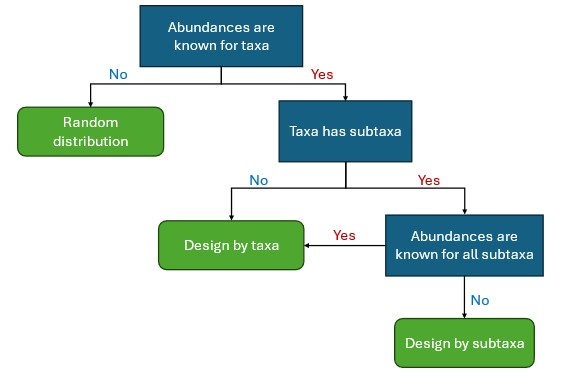

# MeStanG Usage Manual

### Version 0.1

## Table of contents

- [Introduction](#intro) 
- [Sample Design](#sdes) 
  - [Command-line design terms](#clindt) 
  - [Input files for Design as taxa](#iflsdt) 
  - [Input files for Design as subtaxa](#iflsds) 
  - [Input files for Host/Pathogen random mode](#iflhp)
  - [Custom models](#cmods)
- [Output files](#ofls)
- [Limitations](#lims) 

##  Introduction

For sample generation, it is required to provide `.fasta` format files and `.tsv` files with specific formats as input to the workflow, `.fasta` files can have many different entries (Multifasta). All entries from each `.fasta` file will have the same design characteristics as they come from the "same source". Different `.fasta` files can have specific design characteristics defined by the user, if specific features are required for an entry, said entry has to be in a separate `.fasta` file. It is necessary to provide at least **one** `.fasta` and **one** `.tsv` files for each run, explained later in [Input files](#ifls).

##  Sample Design

For design, there are three general specifications.

- Source of the sample: environmental or host/pathogen sample source.
- Taxa abundance: known taxa abundances (standard mode) or unknown abundances (random mode).
- Abundance distribution: by unique taxa or by taxa with unique subtaxa.

Each `.fasta` file can be tagged with a taxon (pl. taxa) for abundance distribution and to trace the source of each member of the community in the generated output (see [Output files](#ofls)). This taxon is a user-defined tag and should be a unique alphanumeric string with no spaces. Taxon also helps to group specific `.fasta` files for abundance distribution. To decide which approach you could use for sample generation use the following graph:

  

Design parameters have to be stated in two ways: command-line design parameters and `.tsv` files.

###  Command-line design parameters

Common to all modes and designs:

- `-f`, `--file`: input file with parameters, this file will contain a list of the `.fasta` files used for sample generation.
- `-n`, `--number`: number of reads to be simulated for each sequence (Default = 100).
- `-m`, `--mean`: Average read length (Default = 2000).
- `-sd`, `--sd_len`: Standard deviation of read length in normal scale (Default = 0).
- `-s`, `--posrate`: Positive sense read rate (From 0 to 1, 0 -> all reads antisense, 1 -> all reads positive strand).
- `-p`, `--profile`: Basecaller profile error model (Default = fast). For dorado the profiles available are fast, hac, sup, and res. For guppy the profiles available are virus, bacteria_ec (for *E. coli*), bacteria_kpn (for *K. pneumoniae*), bacteria (any bacteria), human, and consensus (average profile). You can also choose "perfect" to ignore error rates and generate a 100% identical read subsampling from the input `.fasta` files.
- `-b`, `--basecaller`: Basecaller error model (Default = dorado). Options are dorado and guppy.
- `--circular`: Set genome structure as circular.
- `-c`, `--custom`: File with custom basecalling error model.
- `-em`, `--em_model`: File with custom base emission model.
- `-o`, `--output`: Output directory (Default = MeStanG_output).
- `-t`, `--threads`: Number of threads.
- `--error_profile`: Flag for generating error insertion profile output.
- `--no_metrics`: Flag to skip generating metrics files.
- `--no_ids`: Flag to generate sequences without IDs, normally sequence IDs will resemble the original ID entry of the sequence they come from, to generate sequences with generic IDs use this flag.
- `--unweighted`: Flag to use the same number of reads for every entry in Multifasta files. By default MeStanG will distribute the number of reads of each `.fasta` file among its entries based on their lengths, the longer the read the higher the number of reads distributed to it. While this might make sense mathematically and biologically in some reference genomes like bacterial assemblies where the chromosome makes up to >98% of the genome and the rest is plasmid sequences, it is up to the user to decide whether to use this flag. Using this flag will make MeStanG assign the same `-n` number of reads to each entry.

Specific to certain modes/sample sources:

- `-tx`, `--taxon`: File with taxon designation for Design by subtaxa **or** Host/Pathogen random mode. Not used in environmental random mode.
- `-ct`, `--ctype`: Sample type only for Host/Pathogen random mode. This feature is aimed at Diagnostic assay validation, sample types available are only target "`t`", only decoy "`d`", and target + decoy "`t+d`". Provisional diagnostic sensitivity and specificity can be assessed using this feature as "`t`" samples will be true positives, "`d`" for true negatives, and "`t+d`" to check any possible interactions between the target and decoy.
- `-maxr`, `--max_ratio`: Maximum non-host ratio only for Host/Pathogen random mode (Default = 0.5).
- `-minr`, `--min_ratio`: Minimum non-host ratio only for Host/Pathogen random mode (Default = 0).
- `--equally`: Distribute the abundance of a taxon among subtaxa equally when using Design by subtaxa. Available only in environmental standard mode.
- `--equally_p`: Distribute the abundance of a pathogen among subtaxa equally when using Design by subtaxa or random mode. Available only in Host/Pathogen sample source.
- `--equally_h`: Distribute the abundance of a host among subtaxa equally when using Design by subtaxa or random mode. Available only in Host/Pathogen sample source.

All flag parameters' default value is **false**, using the flag will change it to **true**. To run you need to provide the sample source type (env or host) and the taxa abundance mode (st or rd), so for example, if you want to generate an environmental sample with known abundances run: `MeStanG.py env st`.

###  Input files for Design as taxa

The `.tsv` file required is `-f` and has the following format:

|file	        |taxon	|reads or ratio	   |parameters |...  |
|-------------|-------|------------------|-----------|-----|
|file1.fasta  |tax1   |nreads1 or ratio1 |...        |...  |
|file2.fasta  |tax2   |nreads2 or ratio2 |...        |...  |
|file3.fasta  |tax3   |nreads3 or ratio3 |...        |...  |
|...          |...    |...               |...        |...  |

For all designs, reads or ratio refer to the abundances for each `.fasta` file, only one style can be provided for each run, if using ratio (values from 0 to 1, the total sum has to be 1) the total number of reads for the sample will be taken from `-n` in the command-line design parameters.

When using Design as taxa, the taxon column can be omitted. Parameters can be as many columns as desired from: mean, sd_len, posrate, profile, basecaller, circular, custom, error_profile, no_metrics, unweighted, and equally. All these parameters are the same as stated in [Command-line design parameters](#clindt) and can be customized for each `.fasta` file here. In this design, each `.fasta` file corresponds to unique taxa in the sample.

When setting parameters in the `-f` file they will override the parameters coming from the command line, if a "-" is provided, the value will be taken from the command line. If no value was provided in the command line, the default value for that parameter will be assigned as stated in [Command-line design parameters](#clindt). For flag parameters like circular and error_profile, the value in the `-f` file to use the flag is "true". The hierarchy rules of parameter value inputs (`.tsv` file > Command-line > Default values) apply to all possible designs using MeStanG. You can use the following examples as templates for designing samples:

*Example 1* - Environmental standard sample with abundances provided as the number of reads

Command-line: `MeStanG.py env st -f list.tsv -m 2000 -sd 200 -t 16 --circular --no_metrics --no_ids`

Input file for `-f` :

|file	        |taxon	|reads  |posrate    |basecaller  |profile   |circular    |custom   |
|-------------|-------|-------|-----------|------------|----------|------------|---------|
|file1.fasta  |tax1   |2500   |0.1        |dorado      |sup       |true        |mod.tsv  |
|file2.fasta  |tax2   |1500   |-          |guppy       |virus     |-           |-        |
|file3.fasta  |tax3   |-      |-          |-           |-         |false       |-        |

The parameters for the sample generation that MeStanG will use are:

|input          |file1.fasta	|file2.fasta	|file3.fasta|
|---------------|-------------|-------------|-----------|
|number         |2500	        |1500	        |2000       |
|mean	          |2000	        |2000	        |2000       |
|sd_len	        |200	        |200	        |200        |
|posrate	      |0.1	        |1.0          |1.0        |
|profile	      |sup	        |virus	      |fast       |
|basecaller	    |dorado	      |guppy	      |dorado     |
|circular	      |true	        |true	        |false      |
|custom	        |mod.tsv	    |none	        |none       |
|error_profile	|false	      |false	      |false      |
|no_metrics	    |true	        |true	        |true       |
|unweigthed	    |false	      |false	      |false      |
|equally	      |false	      |false	      |false      |

As seen above, parameters given in the `.tsv` file override parameters given in the command line, parameters not shown in the `.tsv` file take the value from the instructions in the command line, and if they are not defined by the user they will take the default value (fast as profile and dorado as basecaller for file3.fasta). `--no_ids` is a function that works after the sample is generated so it can only be given in the command line.

*Example 2* - Environmental standard sample with abundances provided as relative ratios

Command-line: `MeStanG.py env st -f list.tsv -n 1000 -m 1000 -sd 300 -t 8`

Input file for `-f` :

|file	        |ratio  |mean   |sd_len   |posrate    |profile   |circular    |custom   |
|-------------|-------|-------|---------|-----------|----------|------------|---------|
|file4.fasta  |0.25   |-      |-        |0.3        |sup       |true        |-        |
|file5.fasta  |0.55   |500    |-        |-          |-         |-           |mod.tsv  |
|file6.fasta  |0.2    |2000   |100      |0.4        |-         |-           |-        |

The parameters for the sample generation that MeStanG will use are:

|input          |file4.fasta	|file5.fasta	|file6.fasta|
|---------------|-------------|-------------|-----------|
|number         |248	        |543	        |209        |
|mean	          |1000	        |500	        |2000       |
|sd_len	        |300	        |300	        |100        |
|posrate	      |0.3	        |1.0          |0.4        |
|profile	      |sup	        |fast	        |fast       |
|basecaller	    |dorado	      |dorado	      |dorado     |
|circular	      |true	        |false        |false      |
|custom	        |none   	    |mod.tsv      |none       |
|error_profile	|false	      |false	      |false      |
|no_metrics	    |false	      |false	      |false      |
|unweigthed	    |false	      |false	      |false      |
|equally	      |false	      |false	      |false      |

In this example, abundances were provided as ratios, the total number of reads will be taken from the command-line instructions (or the default value). Abundance in ratios work as probabilities rather than percentages, if a strict number of reads is required in the design provide abundance as the number of reads for each `.fasta` file. The taxon column was omitted in this example.

###  Input files for Design as subtaxa

The `.tsv` files required are `-f` and `-tx`. The `-f` file has the following format:

|file	        |taxon	|
|-------------|-------|
|file1.fasta  |tax1   |
|file2.fasta  |tax1   |
|file3.fasta  |tax2   |
|file4.fasta  |tax2   |
|file5.fasta  |tax2   |
|file6.fasta  |tax3   |
|...          |...    |

For this design, the taxon column must be included and different `.fasta` files are grouped within the same taxa, so each file for this design will be treated as a **subtaxa** (each `.fasta` file) for the grouping **taxa** (user-defined).

The `-tx` file has the following format:

|taxon	|reads or ratio	   |parameters |...  |
|-------|------------------|-----------|-----|
|tax1   |nreads1 or ratio1 |...        |...  |
|tax2   |nreads2 or ratio2 |...        |...  |
|tax3   |nreads3 or ratio3 |...        |...  |
|...    |...               |...        |...  |

The parameters for design are: mean, sd_len, posrate, profile, basecaller, circular, custom, error_profile, no_metrics, unweighted, equally_p, and equally_h.

###  Input files for random distribution mode

For environmental samples, the `.tsv` file required is `-f` with the following format:

|file	        |taxon	|
|-------------|-------|
|file1.fasta  |tax1   |
|file2.fasta  |tax2   |
|file3.fasta  |tax2   |
|file4.fasta  |tax3   |
|file5.fasta  |tax3   |
|...          |...    |

For this design the taxon column must be included, and different `.fasta` files can be grouped within the same taxa. For environmental samples, design parameters are retrieved from the command line specifications.

Additionally for Host/Pathogen samples a second `.tsv` file required for `-tx` with the following format:

|taxon	|type	   |parameters |...  |
|-------|--------|-----------|-----|
|tax1   |type1   |...        |...  |
|tax2   |type2   |...        |...  |
|tax3   |type3   |...        |...  |
|...    |...     |...        |...  |

The parameters for design are: mean, sd_len, posrate, profile, basecaller, circular, custom, error_profile, no_metrics, unweighted, equally_p, and equally_h. The type can be set as target or decoy.

----------------------

For all Host/Pathogen samples at least **one** `.fasta` file must have the "host" (all lowercase) taxon, the total abundance in number of reads has to be provided using `-n` in the command line, and **no** abundance has to be provided for host taxa (use - in the reads/ratio column). You can use the following examples as templates for designing samples:

*Example 3* - Host/Pathogen standard sample with abundances provided as ratios and Design by subtaxa

Command-line: `MeStanG.py host st -f list.tsv -tx tax.tsv -n 1000 -m 1000 -sd 300 --equally_p -t 8`

Input file for `-f`:

|file	        |taxon  |
|-------------|-------|
|file1.fasta  |tax1   |
|file2.fasta  |tax2   |
|file3.fasta  |tax1   |
|file4.fasta  |tax2   |
|file5.fasta  |host   |

Input file for `-tx`:

|taxon        |ratio  |mean   |sd_len   |posrate    |profile   |circular    |custom   |equally_p    |
|-------------|-------|-------|---------|-----------|----------|------------|---------|-------------|
|tax1         |0.20   |-      |-        |0.3        |sup       |true        |-        |-            |
|tax2         |0.10   |500    |20       |-          |-         |-           |mod.tsv  |false        |

The parameters for the sample generation that MeStanG will use are:

|input          |file1.fasta	|file2.fasta	|file3.fasta  |file4.fasta  |file5.fasta  |
|---------------|-------------|-------------|-------------|-------------|-------------|
|number         |106 	        |106	        |71           |37           |680          | 
|mean	          |1000	        |1000	        |500          |500          |1000         | 
|sd_len	        |300	        |300	        |20           |20           |300          | 
|posrate	      |0.3	        |0.3          |1.0          |1.0          |1.0          | 
|profile	      |sup	        |sup	        |fast         |fast         |fast         | 
|basecaller	    |dorado	      |dorado	      |dorado       |dorado       |dorado       | 
|circular	      |true	        |true         |false        |false        |false        | 
|custom	        |none   	    |none         |mod.tsv      |mod.tsv      |false        | 
|error_profile	|false	      |false	      |false        |false        |false        | 
|no_metrics	    |false	      |false	      |false        |false        |false        | 
|unweigthed	    |false	      |false	      |false        |false        |false        | 
|equally	      |true	        |true	        |false        |false        |false        | 

###  Custom models

Custom models can be provided for basecalling and base emission errors. The `.tsv` file for `-c` has the following format:

|           |      |
|-----------|------|
|Mismatch   |pr1   |
|Insertion  |pr2   |
|Deletion   |pr3   |

Probabilities of basecalling error range from 0 to 1, make sure that the total sum of the errors is not higher than 1.

Custom base emission error can be provided in a specific format found in the manuals section (see [Emission Model](em_model.txt)). To input the values in the file you can use the guide from the following tables:

For Insertion error:

|   |A    |C    |G    |T    |
|---|-----|-----|-----|-----|
|A  |0.5  |0.125|0.25 |0.125|
|C  |0.125|0.5  |0.125|0.25 |
|G  |0.25 |0.125|0.5  |0.125|
|T  |0.125|0.25 |0.125|0.5  |

For Mismatch error:

|   |A   |C   |G   |T   |
|---|----|----|----|----|
|A  |x   |0.25|0.5 |0.25|
|C  |0.25|x   |0.25|0.5 |
|G  |0.5 |0.25|x   |0.25|
|T  |0.25|0.5 |0.25|x   |

The tables provided above contain the default values for the emission model used by MeStanG, probabillities between bases are commutative, as an example, for mismatch error the probability of changing A -> C is the same as changing C -> A. To input a custom model it is suggested to remake the tables with the custom model, considering all individual rows and columns' total sum is 1, then change the values in the [Emission Model](em_model.txt) file, and use it as input in `-em`.

##  Output files

The output files will be similar for all designs (`*` stands for the `-o` parameter value provided):

- `*_abundance.tsv`: Details about the absolute and relative abundances of all the "members" in the sample, taxon column will appear if provided in the input files.
- `*_error_profile`: Output with **all** basecalling errors, reporting type of error, length, base change, and position. **Warning**: this file can be *very big* considering it contains all the basecalling errors for all reads, by default this output will not be generated.
- `*_metrics`: File with the basecalling accuracy for each **read** in the sample, including strand sense, starting position in the reference genome (S.pos_genome), read length (bp_ref_genome), #mismatches, #insertions, #deletions, read accuracy, and error rate.
- `*_metrics_summary`: Contains the average basecalling accuracy for each **entry** in the `.fasta` files provided. Includes read length, #mismatches, #insertions, #deletions, accuracy, and error rate.
- `*_parameters.txt`: File with the parameters used for generating reads for each `.fasta` file (similar to the tables of run parameters presented for the examples).
- `*_reads.fasta`:  Sample `.fasta` file with reads according to the design instructions. Additionally, if using Host/Pathogen random mode, a `_t` or `_d` will be added at the beginning of the suffix for target and decoy samples respectively.

##  Limitations and Final remarks

- The accuracy of the generated samples to a real sample depends entirely on the error models, which do not consider homopolymers, sampling noise, naturally occurring mutations, or genome complexity.
- In theory, other platforms' sequencing outputs can be generated using MeStanG if their proper error models are provided as specified in [Custom Models](#cmods) and the read lengths and other design features are modified. This also applies to generate samples containing different variants provided as different `.fasta` files from the same organism.
- The generated samples will resemble the `.fasta` inputs provided by the user so their similarity to real samples depends on the inputs.
- Designs are entirely user-defined and while there are some mathematical validations e.g., in Host/Pathogen scenarios pathogen reads can't be more than host reads, all probabilities sum up to 1, `equally` arguments will distribute the reads as even as possible, among others, the biological sense of the designs is up to the user exclusively. As an example, MeStanG would allow using different basecalling models in the same sample, something not commonly occurring as basecalling is usually performed on all the reads of a sample rather than selectively in read subsets.
